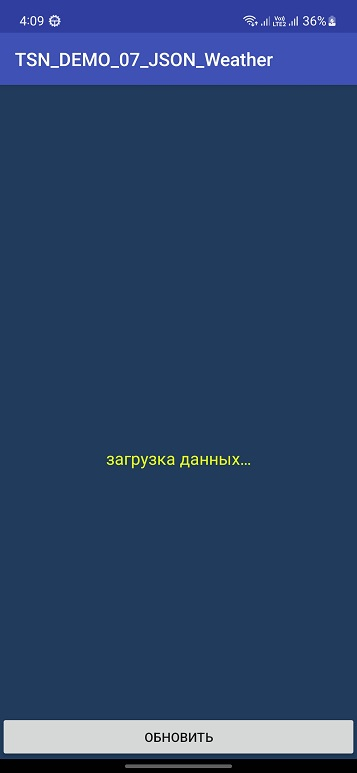
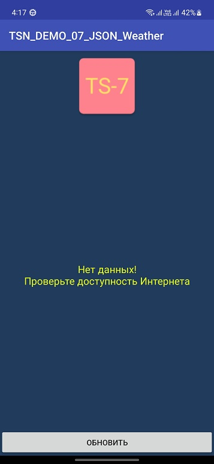
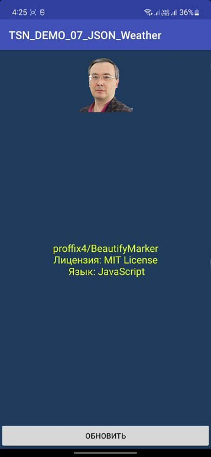
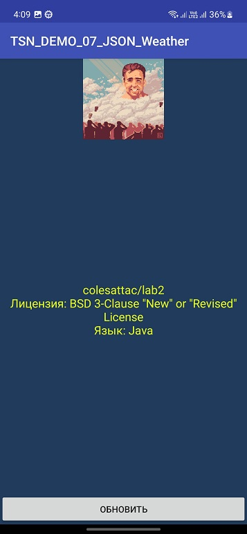

# TSN_DEMO_07_JSON

Лабораторная работа #7

Преподаватель: Талипов С.Н. | https://github.com/proffix4

Выполнил студент группы CS-202(с) Агитаев И.А.

Экран загрузки данных:

Вывод в случае ошибочно введённой ссылки на json или отсутствия интернета:_

Вывод информации о последнем репозитории пользователя proffix4:_

Также работает и с другими пользователями _(для примера был взят мой профиль)_:

