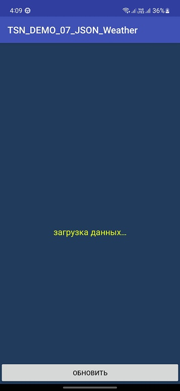
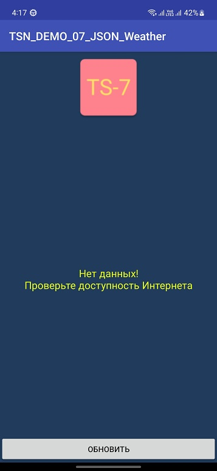
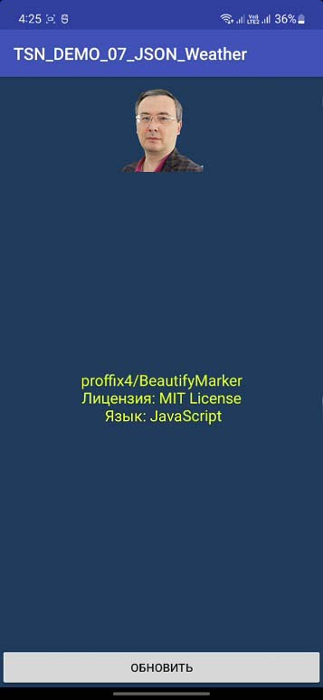
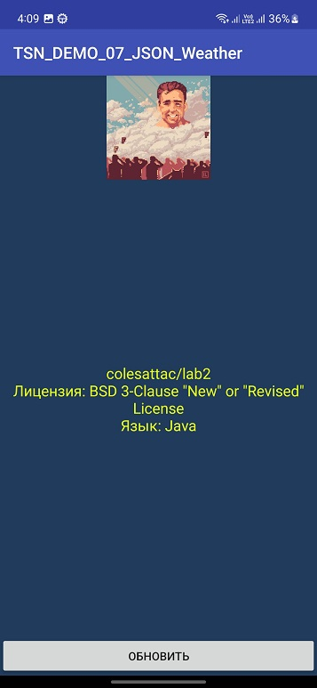

# TSN_DEMO_07_JSON
Практическая работа #7
Преподаватель: Талипов С.Н. | https://github.com/proffix4

Выполнил студент группы CS-202(с) Агитаев И.А.

_Экран загрузки данных:_

_Вывод в случае ошибочно введённой ссылки на json или отсутствия интернета:_

_Вывод информации о последнем репозитории пользователя proffix4:_

_Также работает и с другими пользователями (для примера был взят мой профиль):_

